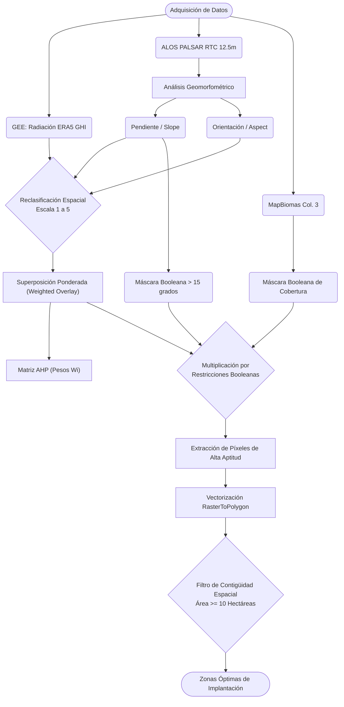



# Título del Proyecto

**Evaluación Espacial Multicriterio y Desarrollo de Herramienta Automatizada para la Identificación de Zonas Aptas para Parques Solares Fotovoltaicos mediante AHP.**

# Introducción y Justificación

La transición hacia matrices energéticas sostenibles requiere la identificación precisa de zonas óptimas para la infraestructura fotovoltaica. A escala de prefactibilidad, la viabilidad espacial de un proyecto depende de la convergencia de variables climáticas, topográficas y ambientales. El diseño de granjas solares con estructuras de inclinación fija es altamente sensible a la geomorfometría del terreno; pendientes pronunciadas y orientaciones inadecuadas generan auto-sombreado entre las filas de paneles y alteran el ángulo de incidencia óptimo de la radiación solar, reduciendo drásticamente la eficiencia energética.

Este proyecto aborda el problema de localización espacial evolucionando desde análisis booleanos básicos (álgebra de mapas de exclusión) hacia Modelos de Soporte a la Decisión Espacial (SDSS) robustos. Mediante la integración del Análisis de Decisión Multicriterio (MCDA), el Proceso de Jerarquía Analítica (AHP) y la automatización algorítmica mediante una *Python Toolbox* en ArcGIS Pro, se provee una solución geomática escalable. Esto permite no solo cartografiar el potencial, sino transformar datos geoespaciales crudos en inteligencia territorial orientada a la planificación energética.

# Estado del Arte y Fundamento Teórico

El modelado del potencial solar y la selección de sitios ha experimentado una profunda evolución metodológica impulsada por los avances en la Geomática moderna y la teledetección. 

## Cloud Computing y Cuantificación del Recurso Solar

Históricamente, los mapas de radiación se basaban en la interpolación espacial de estaciones meteorológicas terrestres, las cuales presentan baja densidad en países en desarrollo. Actualmente, el uso de plataformas *Cloud-Native* como Google Earth Engine (GEE) permite procesar petabytes de información satelital y productos de reanálisis global, como ERA5-Land [@munoz2021]. Investigaciones recientes, como la de Haz et al. [@haz2025], demuestran que la integración de GEE permite modelar la Radiación Global Horizontal (GHI) con alta fidelidad, validando los resultados frente a catálogos como NASA POWER mediante métricas estadísticas (RMSE, MAPE), garantizando así el insumo climático base.

## Modelado de Idoneidad Espacial (GIS-MCDA y AHP)

Debido a que la selección de sitios es un problema multidimensional, la hibridación de los Sistemas de Información Geográfica con el Análisis de Decisión Multicriterio (GIS-MCDA) se ha posicionado como el estándar global [@malczewski2006]. Liu et al. [@liu2024] aplicaron el Proceso de Jerarquía Analítica (AHP) en Mongolia Interior para integrar dimensiones climáticas, topográficas y de cobertura, demostrando que la normalización de variables heterogéneas reduce el conflicto en la toma de decisiones. Asimismo, Melana et al. [@melana2025] introducen lógicas de dos niveles: (1) la exclusión estricta de áreas protegidas y zonas urbanas mediante operaciones booleanas, y (2) la reclasificación continua de las zonas viables utilizando un *Suitability Modeler*.

## Vacío Tecnológico y Aporte del Proyecto

A pesar de estos avances, un porcentaje significativo de los estudios a escala regional obvian la micro-topografía, utilizando Modelos Digitales de Elevación (DEM) de 30m o 90m que enmascaran la rugosidad real del terreno. Este proyecto subsana dicho vacío al incorporar topografía de mayor resolución (ALOS PALSAR 12.5m) para capturar las variaciones geomorfométricas sutiles. Además, se supera el paradigma del mapa estático al empaquetar el flujo lógico en una herramienta automatizada (Scripting en Python), capaz de filtrar espacialmente la idoneidad bajo restricciones de área mínima de operación (10 MW).

# Objetivos

**Objetivo General:**
Desarrollar un modelo geomático multicriterio (AHP) y una herramienta automatizada de geoprocesamiento (Python Toolbox) para identificar zonas con máxima idoneidad espacial para la instalación de parques solares, optimizando la topografía de alta resolución y el potencial de radiación.

**Objetivos Específicos:**
1. Extraer y armonizar espacialmente índices climáticos (GHI vía GEE) y geomorfométricos (Pendiente, Orientación) desde un DEM ALOS PALSAR de 12.5m.
2. Estructurar una matriz de decisión AHP para estandarizar las variables geoespaciales, validando su confiabilidad matemática mediante el Índice de Consistencia ($CR < 0.1$).
3. Desarrollar un script de automatización (`arcpy`) que ejecute la superposición ponderada y extraiga vectorialmente polígonos viables contiguos $\ge 10$ hectáreas.

# Área de Estudio

El proyecto se despliega en dos escenarios con el fin de calibrar y validar el modelo geomático:

**Zona Piloto Metodológica (Vegachí y Remedios, Antioquia):** Seleccionada estratégicamente por su elevada complejidad topográfica. Las laderas pronunciadas de esta región andina permiten validar la eficacia de los filtros de exclusión por pendiente y la influencia de la orientación geomorfológica (*Aspect*).

# Variables Espaciales y Estructura de Restricciones

La conceptualización del modelo exige la armonización de diversos *datasets* bajo un mismo Sistema de Referencia de Coordenadas (CRS) y resolución de píxel. Siguiendo el estándar de la literatura [@melana2025; @liu2024], los parámetros se dividen en Factores de Exclusión y Criterios de Evaluación.

## Factores de Exclusión (Máscaras Booleanas)
Se aplica álgebra de mapas multiplicativa, donde el valor '0' inhabilita el píxel para el resto del análisis.

**Tabla 1. Restricciones Espaciales Absolutas**

| Variable Espacial | Umbral de Restricción | Justificación Geomática |
| :--- | :--- | :--- |
| **Pendiente** | $> 15^{\circ}$ | Alteración del ángulo de incidencia solar y auto-sombreado entre filas. |
| **Orientación (Aspect)** | Norte, Noroeste | Reducción severa de captación de radiación directa en latitudes tropicales. |
| **Cobertura (MapBiomas)** | Bosques (1-6), Agua (33), Urbano (24) | Restricciones de conservación ambiental y conflicto de uso del suelo. |
| **Escala Espacial** | Área continua $< 10$ ha | Imposibilidad física de albergar el estándar industrial de 10 MW. |

## Criterios de Evaluación Continua
Los píxeles que sobreviven a la exclusión (valor '1') se reclasifican en una escala de idoneidad estandarizada (1 = Pobre a 5 = Excelente).

**Tabla 2. Rangos de Reclasificación Espacial**

| Criterio | Peso (AHP) | Excelente (5) | Bueno (4) | Moderado (3) | Pobre (1-2) |
| :--- | :--- | :--- | :--- | :--- | :--- |
| **GHI (kWh/m²/día)** | *A calcular* | $> 5.5$ | $5.0 - 5.5$ | $4.5 - 5.0$ | $< 4.5$ |
| **Pendiente (Grados)** | *A calcular* | $0 - 5^\circ$ | $5 - 10^\circ$ | $10 - 15^\circ$ | $> 15^\circ$ (N/A) |
| **Orientación** | *A calcular* | Sur, Sureste | Suroeste | Este, Oeste | Norte (N/A) |

# Metodología y Procesamiento Geoinformático

## Modelado Matemático de Consistencia (AHP)
Para evitar la subjetividad en el álgebra de mapas, se emplea el Proceso de Jerarquía Analítica propuesto por Saaty [@saaty1980]. Tras establecer la matriz de comparación por pares de tamaño $n \times n$, se calcula el vector propio principal para extraer los pesos $W_i$. 

La validez del modelo se aprueba calculando la Relación de Consistencia ($CR$):
$$CR = \frac{CI}{RI}$$
Donde el Índice de Consistencia ($CI$) se define como:
$$CI = \frac{\lambda_{max} - n}{n - 1}$$
*(Siendo $\lambda_{max}$ el eigenvalor máximo. Solo se aceptan matrices con $CR < 0.10$ [@islam2024]).*

La función de idoneidad espacial ($S$) procesada píxel a píxel se expresa como:
$$S = \sum_{i=1}^{n} (W_i \times C_i) \times \prod_{j=1}^{m} R_j$$

## Diagrama de Flujo del Geoprocesamiento

A continuación, se presenta la arquitectura del modelo lógico, desde la adquisición en GEE hasta la vectorización automatizada.



## Integración del Código: Automatización mediante PyQGIS/Arcpy

Para garantizar la reproducibilidad y escalar el análisis, la lógica matemática se codifica en una herramienta de geoprocesamiento. El siguiente bloque ilustra el "core" del script espacial:

```python
import arcpy
from arcpy.sa import *

def modelador_aptitud_solar(slope_raster, aspect_raster, ghi_raster, lulc_raster, out_poly):
    """
    Automatización del SDSS (Spatial Decision Support System) para parques solares.
    Aplica exclusión booleana, reclass AHP y filtro de área.
    """
    arcpy.env.overwriteOutput = True
    arcpy.CheckOutExtension("Spatial")

    # 1. Filtro Booleano de Exclusión (Pendientes > 15 grados inviables)
    mask_slope = Con(Raster(slope_raster) <= 15, 1, 0)
    
    # 2. Estandarización de Escalas de Aptitud Geomorfométrica (1 a 5)
    # Pendiente: 0-5 (Excelente: 5), 5-10 (Buena: 3), 10-15 (Pobre: 1)
    remap_slope = RemapRange([[0, 5, 5], [5, 10, 3], [10, 15, 1]])
    slope_reclass = Reclassify(slope_raster, "Value", remap_slope)
    
    # 3. Superposición Ponderada (Valores hipotéticos derivados de Matriz AHP)
    # WOTable Sintaxis: [Raster, % Peso, Campo]
    myWOTable = WOTable([
        [slope_reclass, 40, "Value"], # Alta penalización al terreno abrupto
        [ghi_raster, 35, "Value"],    # Potencial energético
        [aspect_raster, 25, "Value"]  # Orientación de ladera
    ], [1, 5, 1]) 
    
    suitability_raw = WeightedOverlay(myWOTable)
    
    # 4. Álgebra de Mapas Multiplicativa (Aptitud x Restricciones)
    final_suitability = suitability_raw * mask_slope

    # 5. Extracción de Alta Aptitud y Vectorización
    optimal_raster = Con(final_suitability >= 4, 1)
    temp_poly = "in_memory/optimal_poly"
    arcpy.conversion.RasterToPolygon(optimal_raster, temp_poly, "NO_SIMPLIFY", "Value")

    # 6. Filtro Espacial: Contigüidad geométrica (>= 10 Hectáreas / 100,000 m2)
    arcpy.management.SelectLayerByAttribute(temp_poly, "NEW_SELECTION", "Shape_Area >= 100000")
    arcpy.management.CopyFeatures(temp_poly, out_poly)
    arcpy.AddMessage(f"Análisis finalizado exitosamente. Output: {out_poly}")
```

# Resultados Esperados y Discusión

## Parámetros AHP y Modelado Espacial
Se espera que el cálculo del AHP otorgue una prevalencia significativa a las variables geomorfométricas (Pendiente y Aspecto) en regiones andinas como Antioquia, dado que el sombreado estructural minimiza los beneficios de una alta radiación teórica. El $CR$ resultante dotará al modelo del rigor estadístico necesario para justificar decisiones de inversión.8.2. Contraste entre Escenarios (Antioquia vs. Córdoba)La cartografía temática de aptitud (Suitability Map) revelará distribuciones espaciales diametralmente opuestas. En Vegachí y Remedios, se proyecta que la máscara booleana elimine más del 70% del territorio inicial, y el filtro de contigüidad espacial ($\ge 10\text{ ha}$) descarte las laderas fragmentadas, aislando únicamente pequeñas mesetas, extrayendo polígonos  continuos ideales para un diseño rápido de ingeniería de detalle.

# Conclusiones

Avance Metodológico: La transición de análisis booleanos convencionales a un Modelo de Decisión Multicriterio (AHP), validado mediante el Índice de Consistencia ($CR$), elimina la subjetividad en la selección de sitios, alineando la Geomática con estándares científicos internacionales.Resolución y Precisión Espacial: El uso de DEM de alta resolución (ALOS 12.5m) demostró ser crítico para evaluar la micro-topografía; omitir este nivel de detalle generaría falsos positivos en zonas escarpadas propensas a altos porcentajes de auto-sombreado.Automatización y Escalabilidad: El desarrollo del script espacial transforma una tarea GIS manual y repetitiva en una herramienta de Inteligencia Territorial automatizada, capaz de aplicar filtros de viabilidad financiera (polígonos continuos para 10 MW) en segundos, optimizando la planificación estratégica en el sector de las energías renovables.

# Referencias

::: {#refs}
:::

# Anexos
Anexo A: Tablas de Reclasificación Espacial por Variable.
Anexo B: Matriz de Decisión Saaty y Cálculo de Eigenvalores.